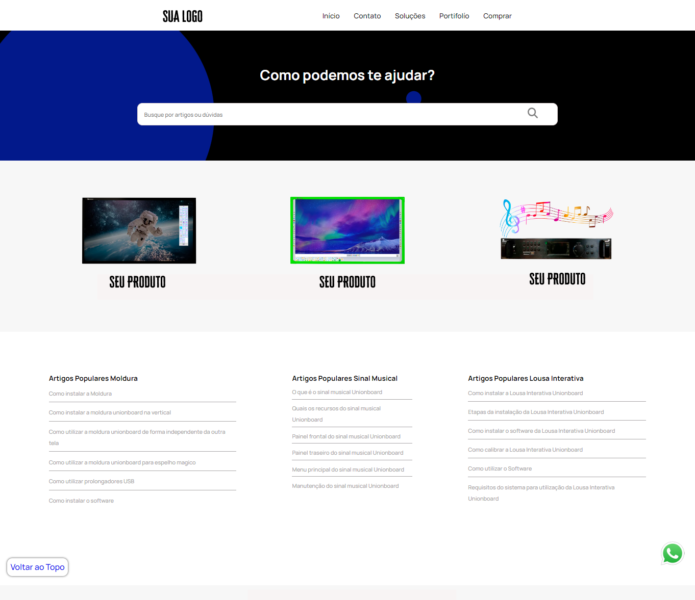
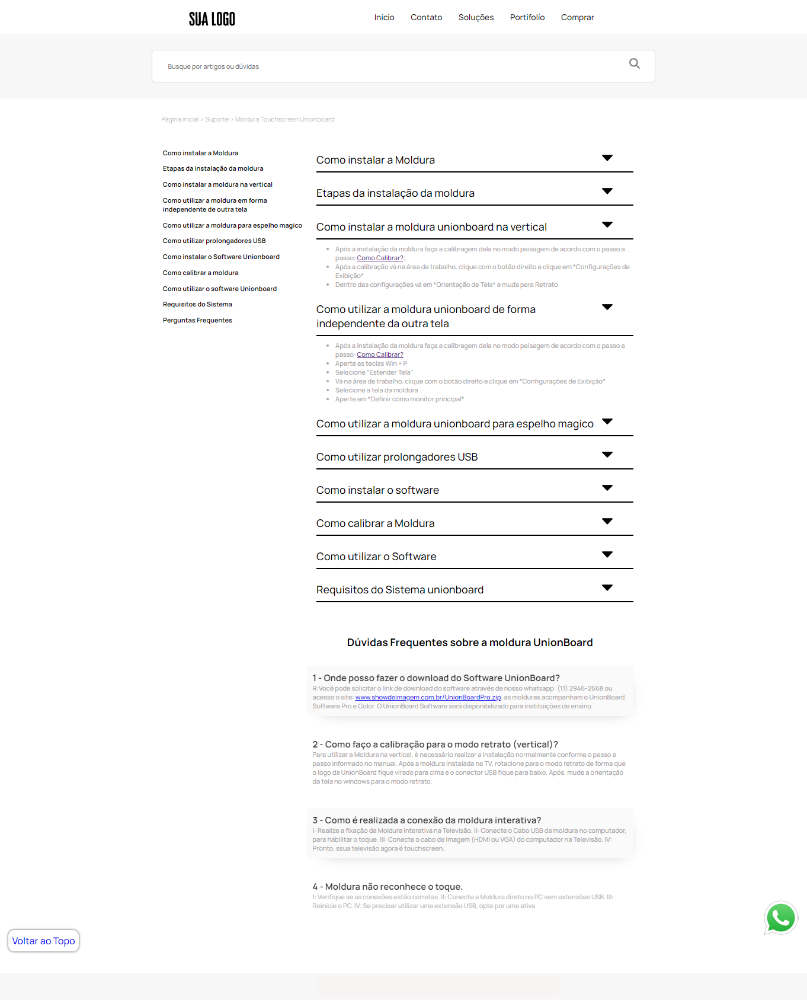
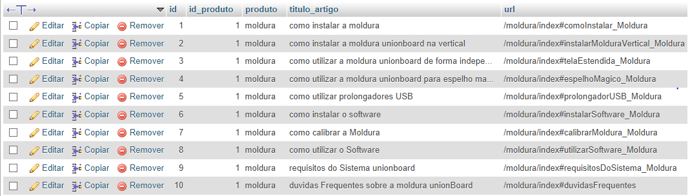
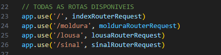

# Site de suporte para produtos diversos


  

> Site de suporte para produtos diversos:
> O site tem como objetivo fornecer uma interface intuitiva para empresas que necessitem de um suporte para seus produtos. Assim fornecendo o melhor apoio para seus clientes

## 💻 Pré-requisitos

Antes de começar, verifique se você atendeu aos seguintes requisitos:

* Você instalou a versão mais recente do `<NodeJS / MySQL>`
* Você tem uma máquina `<Windows / Linux / Mac>`.
  
## 🚀 Instalando Site de suporte

Para instalar o Site de suporte, siga estas etapas:

> Abra o terminal no diretório raiz do projeto e digite:
```
npm i
```
> Após a instalação das dependências importe o o arquivo `suporte.sql` para dentro do seu banco de dados.

> Acesse o arquivos `ConfiguracaoDatabase.js` e mude os campos:
> `Host, user, password e database` Coloque os dados de seu banco de dados

```
npm start
```
 
## ☕ Usando Site de suporte

Para usar o Site de suporte, siga estas etapas:
>Após a instalação das dependêcias você pode configurar os produtos para seu suporte:
>Modifique os campos do banco de dados:
<<<<<<< HEAD


>Não se esqueça de acionar novas rotas e controllers para os novos produtos

=======


>Não se esqueça de acionar novas rotas e controllers para os novos produtos

>>>>>>> f17023f07beec8f6c6b4eec6c3a504bfb78d379b

## 🤝 Colaboradores

Agradecemos às seguintes pessoas que contribuíram para este projeto:

<table>
  <tr>
    <td align="center">
      <a href="#">
        <br>
        <sub>
          <b>Mark Zuckerberg</b>
        </sub>
      </a>
    </td>
  </tr>
</table>

## 📝 Licença

Esse projeto está sob licença. Veja o arquivo [LICENÇA](LICENSE.md) para mais detalhes.
